# Package Dependency Tree

This page is generated from the machine-readable package graph at
`packages/package_graph.yaml` and validated against the direct dependency
metadata in `packages/*/pyproject.toml`.

Use it as the evidence view, not the primary human ownership guide.

- For the canonical human package hierarchy, read [`package_layout.md`](package_layout.md).
- For the import/dependency guardrails, read [`import_boundary_rules.md`](import_boundary_rules.md).

Regenerate it with:

```bash
./tools/package-deps generate
```

Check it with:

```bash
./tools/package-deps check
```

## Summary

- `hla2010-spec` is the single true root package.
- Shared support packages: `hla2010-rti-backend-common`, `hla2010-rti-runtime-common`, `hla2010-rti-transport-common`, `hla2010-verification-harness`.
- Python and Java backend families are separated; `hla2010-rti-python` depends on backend-common rather than on Java support packages.
- Transport packages are explicit leaves in the graph: `hla2010-rti-transport-grpc`, `hla2010-rti-transport-rest`.
- FOM/example leaf packages are explicit in the graph: `hla2010-fom-minimal-demo`, `hla2010-fom-target-radar`.

## Dependency Layers

- Layer 0: `hla2010-spec`
- Layer 1: `hla2010-rti-backend-common`
- Layer 2: `hla2010-rti-java-common`, `hla2010-rti-python`, `hla2010-rti-transport-common`
- Layer 3: `hla2010-rti-java-jpype`, `hla2010-rti-java-py4j`, `hla2010-rti-runtime-common`
- Layer 4: `hla2010-rti-certi`, `hla2010-rti-pitch-common`, `hla2010-rti-portico`, `hla2010-rti-transport-grpc`, `hla2010-rti-transport-rest`, `hla2010-verification-harness`
- Layer 5: `hla2010-fom-minimal-demo`, `hla2010-fom-target-radar`, `hla2010-rti-pitch-jpype`, `hla2010-rti-pitch-py4j`

## Direct Graph

```mermaid
graph TD
    hla2010_rti_runtime_common[hla2010-rti-runtime-common] --> hla2010_fom_minimal_demo[hla2010-fom-minimal-demo]
    hla2010_spec[hla2010-spec] --> hla2010_fom_minimal_demo[hla2010-fom-minimal-demo]
    hla2010_rti_runtime_common[hla2010-rti-runtime-common] --> hla2010_fom_target_radar[hla2010-fom-target-radar]
    hla2010_spec[hla2010-spec] --> hla2010_fom_target_radar[hla2010-fom-target-radar]
    hla2010_verification_harness[hla2010-verification-harness] --> hla2010_fom_target_radar[hla2010-fom-target-radar]
    hla2010_spec[hla2010-spec] --> hla2010_rti_backend_common[hla2010-rti-backend-common]
    hla2010_rti_java_common[hla2010-rti-java-common] --> hla2010_rti_certi[hla2010-rti-certi]
    hla2010_rti_runtime_common[hla2010-rti-runtime-common] --> hla2010_rti_certi[hla2010-rti-certi]
    hla2010_rti_transport_common[hla2010-rti-transport-common] --> hla2010_rti_certi[hla2010-rti-certi]
    hla2010_spec[hla2010-spec] --> hla2010_rti_certi[hla2010-rti-certi]
    hla2010_rti_backend_common[hla2010-rti-backend-common] --> hla2010_rti_java_common[hla2010-rti-java-common]
    hla2010_spec[hla2010-spec] --> hla2010_rti_java_common[hla2010-rti-java-common]
    hla2010_rti_java_common[hla2010-rti-java-common] --> hla2010_rti_java_jpype[hla2010-rti-java-jpype]
    hla2010_spec[hla2010-spec] --> hla2010_rti_java_jpype[hla2010-rti-java-jpype]
    hla2010_rti_java_common[hla2010-rti-java-common] --> hla2010_rti_java_py4j[hla2010-rti-java-py4j]
    hla2010_spec[hla2010-spec] --> hla2010_rti_java_py4j[hla2010-rti-java-py4j]
    hla2010_rti_java_common[hla2010-rti-java-common] --> hla2010_rti_pitch_common[hla2010-rti-pitch-common]
    hla2010_rti_runtime_common[hla2010-rti-runtime-common] --> hla2010_rti_pitch_common[hla2010-rti-pitch-common]
    hla2010_spec[hla2010-spec] --> hla2010_rti_pitch_common[hla2010-rti-pitch-common]
    hla2010_rti_java_common[hla2010-rti-java-common] --> hla2010_rti_pitch_jpype[hla2010-rti-pitch-jpype]
    hla2010_rti_java_jpype[hla2010-rti-java-jpype] --> hla2010_rti_pitch_jpype[hla2010-rti-pitch-jpype]
    hla2010_rti_pitch_common[hla2010-rti-pitch-common] --> hla2010_rti_pitch_jpype[hla2010-rti-pitch-jpype]
    hla2010_spec[hla2010-spec] --> hla2010_rti_pitch_jpype[hla2010-rti-pitch-jpype]
    hla2010_rti_java_common[hla2010-rti-java-common] --> hla2010_rti_pitch_py4j[hla2010-rti-pitch-py4j]
    hla2010_rti_java_py4j[hla2010-rti-java-py4j] --> hla2010_rti_pitch_py4j[hla2010-rti-pitch-py4j]
    hla2010_rti_pitch_common[hla2010-rti-pitch-common] --> hla2010_rti_pitch_py4j[hla2010-rti-pitch-py4j]
    hla2010_spec[hla2010-spec] --> hla2010_rti_pitch_py4j[hla2010-rti-pitch-py4j]
    hla2010_rti_java_common[hla2010-rti-java-common] --> hla2010_rti_portico[hla2010-rti-portico]
    hla2010_rti_java_jpype[hla2010-rti-java-jpype] --> hla2010_rti_portico[hla2010-rti-portico]
    hla2010_rti_java_py4j[hla2010-rti-java-py4j] --> hla2010_rti_portico[hla2010-rti-portico]
    hla2010_spec[hla2010-spec] --> hla2010_rti_portico[hla2010-rti-portico]
    hla2010_rti_backend_common[hla2010-rti-backend-common] --> hla2010_rti_python[hla2010-rti-python]
    hla2010_rti_transport_common[hla2010-rti-transport-common] --> hla2010_rti_python[hla2010-rti-python]
    hla2010_spec[hla2010-spec] --> hla2010_rti_python[hla2010-rti-python]
    hla2010_rti_backend_common[hla2010-rti-backend-common] --> hla2010_rti_runtime_common[hla2010-rti-runtime-common]
    hla2010_rti_transport_common[hla2010-rti-transport-common] --> hla2010_rti_runtime_common[hla2010-rti-runtime-common]
    hla2010_spec[hla2010-spec] --> hla2010_rti_runtime_common[hla2010-rti-runtime-common]
    hla2010_rti_backend_common[hla2010-rti-backend-common] --> hla2010_rti_transport_common[hla2010-rti-transport-common]
    hla2010_spec[hla2010-spec] --> hla2010_rti_transport_common[hla2010-rti-transport-common]
    hla2010_rti_backend_common[hla2010-rti-backend-common] --> hla2010_rti_transport_grpc[hla2010-rti-transport-grpc]
    hla2010_rti_runtime_common[hla2010-rti-runtime-common] --> hla2010_rti_transport_grpc[hla2010-rti-transport-grpc]
    hla2010_rti_transport_common[hla2010-rti-transport-common] --> hla2010_rti_transport_grpc[hla2010-rti-transport-grpc]
    hla2010_spec[hla2010-spec] --> hla2010_rti_transport_grpc[hla2010-rti-transport-grpc]
    hla2010_rti_backend_common[hla2010-rti-backend-common] --> hla2010_rti_transport_rest[hla2010-rti-transport-rest]
    hla2010_rti_runtime_common[hla2010-rti-runtime-common] --> hla2010_rti_transport_rest[hla2010-rti-transport-rest]
    hla2010_rti_transport_common[hla2010-rti-transport-common] --> hla2010_rti_transport_rest[hla2010-rti-transport-rest]
    hla2010_spec[hla2010-spec] --> hla2010_rti_transport_rest[hla2010-rti-transport-rest]
    hla2010_spec[hla2010-spec]
    hla2010_rti_backend_common[hla2010-rti-backend-common] --> hla2010_verification_harness[hla2010-verification-harness]
    hla2010_rti_runtime_common[hla2010-rti-runtime-common] --> hla2010_verification_harness[hla2010-verification-harness]
    hla2010_spec[hla2010-spec] --> hla2010_verification_harness[hla2010-verification-harness]
```



## Direct Dependencies

| Package | Layer | Role | Internal deps | External deps |
| --- | --- | --- | --- | --- |
| `hla2010-fom-minimal-demo` | `5` | `fom-example` | `hla2010-rti-runtime-common, hla2010-spec` | `-` |
| `hla2010-fom-target-radar` | `5` | `fom-example` | `hla2010-rti-runtime-common, hla2010-spec, hla2010-verification-harness` | `-` |
| `hla2010-rti-backend-common` | `1` | `backend-support` | `hla2010-spec` | `-` |
| `hla2010-rti-certi` | `4` | `rti-backend` | `hla2010-rti-java-common, hla2010-rti-runtime-common, hla2010-rti-transport-common, hla2010-spec` | `-` |
| `hla2010-rti-java-common` | `2` | `java-support` | `hla2010-rti-backend-common, hla2010-spec` | `-` |
| `hla2010-rti-java-jpype` | `3` | `java-bridge` | `hla2010-rti-java-common, hla2010-spec` | `jpype1` |
| `hla2010-rti-java-py4j` | `3` | `java-bridge` | `hla2010-rti-java-common, hla2010-spec` | `py4j` |
| `hla2010-rti-pitch-common` | `4` | `runtime-common` | `hla2010-rti-java-common, hla2010-rti-runtime-common, hla2010-spec` | `-` |
| `hla2010-rti-pitch-jpype` | `5` | `rti-backend` | `hla2010-rti-java-common, hla2010-rti-java-jpype, hla2010-rti-pitch-common, hla2010-spec` | `-` |
| `hla2010-rti-pitch-py4j` | `5` | `rti-backend` | `hla2010-rti-java-common, hla2010-rti-java-py4j, hla2010-rti-pitch-common, hla2010-spec` | `-` |
| `hla2010-rti-portico` | `4` | `rti-backend` | `hla2010-rti-java-common, hla2010-rti-java-jpype, hla2010-rti-java-py4j, hla2010-spec` | `-` |
| `hla2010-rti-python` | `2` | `rti-backend` | `hla2010-rti-backend-common, hla2010-rti-transport-common, hla2010-spec` | `-` |
| `hla2010-rti-runtime-common` | `3` | `runtime-support` | `hla2010-rti-backend-common, hla2010-rti-transport-common, hla2010-spec` | `-` |
| `hla2010-rti-transport-common` | `2` | `transport-support` | `hla2010-rti-backend-common, hla2010-spec` | `-` |
| `hla2010-rti-transport-grpc` | `4` | `transport` | `hla2010-rti-backend-common, hla2010-rti-runtime-common, hla2010-rti-transport-common, hla2010-spec` | `grpcio` |
| `hla2010-rti-transport-rest` | `4` | `transport` | `hla2010-rti-backend-common, hla2010-rti-runtime-common, hla2010-rti-transport-common, hla2010-spec` | `-` |
| `hla2010-spec` | `0` | `core-spec` | `-` | `-` |
| `hla2010-verification-harness` | `4` | `verification-harness` | `hla2010-rti-backend-common, hla2010-rti-runtime-common, hla2010-spec` | `-` |
