# Package Dependency Tree

This page is generated from the `project.dependencies` fields in
`packages/*/pyproject.toml`.

Use this page to answer three practical questions:

1. what is the architectural root package
2. which packages are shared support versus concrete backends or leaves
3. whether a new dependency is moving in the right direction

Regenerate it with:

```bash
./tools/package-deps generate
```

## Summary

- `hla-rti1516e` is the single true root package.
- `hla-backend-common`, `hla-rti-core`, `hla-transport-common`, and `hla-verification` are the shared support layers.
- Python and Java backend families are separated; `hla-backend-inmemory` depends on backend-common rather than on Java support packages.
- transport packages depend on `hla-rti1516e`, `hla-backend-common`, `hla-transport-common`, and for hosted transports also `hla-rti-core`.
- FOM and verification leaf packages depend only on `hla-rti1516e` and `hla-verification`.

## How To Read It

Read the page from top to bottom:

1. summary for the mental model
2. layers for package rank
3. graph for direct edges
4. table for manifest-level details

If you need the policy behind the graph, read
[`import_boundary_rules.md`](import_boundary_rules.md) and
[`package_layout.md`](package_layout.md).

## Dependency Layers

- Layer 0: `hla-rti1516e`
- Layer 1: `hla-backend-common`
- Layer 2: `hla-bridge-java-common`, `hla-backend-inmemory`, `hla-transport-common`
- Layer 3: `hla-bridge-java-jpype`, `hla-bridge-java-py4j`, `hla-rti-core`
- Layer 4: `hla-backend-certi`, `hla-vendor-pitch`, `hla-vendor-portico`, `hla-transport-grpc`, `hla-transport-rest`, `hla-verification`
- Layer 5: `hla-fom-target-radar`, `hla-vendor-pitch-jpype`, `hla-vendor-pitch-py4j`

## Direct Graph

```mermaid
graph TD
    hla.rti[hla-rti-core] --> hla.foms.target_radar[hla-fom-target-radar]
    hla2010_spec[hla-rti1516e] --> hla.foms.target_radar[hla-fom-target-radar]
    hla.verification[hla-verification] --> hla.foms.target_radar[hla-fom-target-radar]
    hla2010_spec[hla-rti1516e] --> hla.backends.common[hla-backend-common]
    hla.bridges.java.common[hla-bridge-java-common] --> hla.backends.certi[hla-backend-certi]
    hla.rti[hla-rti-core] --> hla.backends.certi[hla-backend-certi]
    hla.transports.common[hla-transport-common] --> hla.backends.certi[hla-backend-certi]
    hla2010_spec[hla-rti1516e] --> hla.backends.certi[hla-backend-certi]
    hla.backends.common[hla-backend-common] --> hla.bridges.java.common[hla-bridge-java-common]
    hla2010_spec[hla-rti1516e] --> hla.bridges.java.common[hla-bridge-java-common]
    hla.bridges.java.common[hla-bridge-java-common] --> hla.bridges.java.jpype[hla-bridge-java-jpype]
    hla2010_spec[hla-rti1516e] --> hla.bridges.java.jpype[hla-bridge-java-jpype]
    hla.bridges.java.common[hla-bridge-java-common] --> hla.bridges.java.py4j[hla-bridge-java-py4j]
    hla2010_spec[hla-rti1516e] --> hla.bridges.java.py4j[hla-bridge-java-py4j]
    hla.bridges.java.common[hla-bridge-java-common] --> hla.vendors.pitch[hla-vendor-pitch]
    hla.rti[hla-rti-core] --> hla.vendors.pitch[hla-vendor-pitch]
    hla2010_spec[hla-rti1516e] --> hla.vendors.pitch[hla-vendor-pitch]
    hla.bridges.java.common[hla-bridge-java-common] --> hla.vendors.pitch.jpype[hla-vendor-pitch-jpype]
    hla.bridges.java.jpype[hla-bridge-java-jpype] --> hla.vendors.pitch.jpype[hla-vendor-pitch-jpype]
    hla.vendors.pitch[hla-vendor-pitch] --> hla.vendors.pitch.jpype[hla-vendor-pitch-jpype]
    hla2010_spec[hla-rti1516e] --> hla.vendors.pitch.jpype[hla-vendor-pitch-jpype]
    hla.bridges.java.common[hla-bridge-java-common] --> hla.vendors.pitch.py4j[hla-vendor-pitch-py4j]
    hla.bridges.java.py4j[hla-bridge-java-py4j] --> hla.vendors.pitch.py4j[hla-vendor-pitch-py4j]
    hla.vendors.pitch[hla-vendor-pitch] --> hla.vendors.pitch.py4j[hla-vendor-pitch-py4j]
    hla2010_spec[hla-rti1516e] --> hla.vendors.pitch.py4j[hla-vendor-pitch-py4j]
    hla.bridges.java.common[hla-bridge-java-common] --> hla.vendors.portico[hla-vendor-portico]
    hla.bridges.java.jpype[hla-bridge-java-jpype] --> hla.vendors.portico[hla-vendor-portico]
    hla.bridges.java.py4j[hla-bridge-java-py4j] --> hla.vendors.portico[hla-vendor-portico]
    hla2010_spec[hla-rti1516e] --> hla.vendors.portico[hla-vendor-portico]
    hla.backends.common[hla-backend-common] --> hla.backends.inmemory[hla-backend-inmemory]
    hla2010_spec[hla-rti1516e] --> hla.backends.inmemory[hla-backend-inmemory]
    hla.backends.common[hla-backend-common] --> hla.rti[hla-rti-core]
    hla.transports.common[hla-transport-common] --> hla.rti[hla-rti-core]
    hla2010_spec[hla-rti1516e] --> hla.rti[hla-rti-core]
    hla.backends.common[hla-backend-common] --> hla.transports.common[hla-transport-common]
    hla2010_spec[hla-rti1516e] --> hla.transports.common[hla-transport-common]
    hla.backends.common[hla-backend-common] --> hla.transports.grpc[hla-transport-grpc]
    hla.rti[hla-rti-core] --> hla.transports.grpc[hla-transport-grpc]
    hla.transports.common[hla-transport-common] --> hla.transports.grpc[hla-transport-grpc]
    hla2010_spec[hla-rti1516e] --> hla.transports.grpc[hla-transport-grpc]
    hla.backends.common[hla-backend-common] --> hla.transports.rest[hla-transport-rest]
    hla.rti[hla-rti-core] --> hla.transports.rest[hla-transport-rest]
    hla.transports.common[hla-transport-common] --> hla.transports.rest[hla-transport-rest]
    hla2010_spec[hla-rti1516e] --> hla.transports.rest[hla-transport-rest]
    hla2010_spec[hla-rti1516e]
    hla.backends.common[hla-backend-common] --> hla.verification[hla-verification]
    hla.rti[hla-rti-core] --> hla.verification[hla-verification]
    hla2010_spec[hla-rti1516e] --> hla.verification[hla-verification]
```



## Direct Dependencies

| Package | Internal deps | External deps |
| --- | --- | --- |
| `hla-fom-target-radar` | `hla-rti1516e, hla-verification, hla-rti-core` | `-` |
| `hla-backend-common` | `hla-rti1516e` | `-` |
| `hla-backend-certi` | `hla-rti1516e, hla-bridge-java-common, hla-rti-core, hla-transport-common` | `-` |
| `hla-bridge-java-common` | `hla-rti1516e, hla-backend-common` | `-` |
| `hla-bridge-java-jpype` | `hla-rti1516e, hla-bridge-java-common` | `jpype1` |
| `hla-bridge-java-py4j` | `hla-rti1516e, hla-bridge-java-common` | `py4j` |
| `hla-vendor-pitch` | `hla-rti1516e, hla-bridge-java-common, hla-rti-core` | `-` |
| `hla-vendor-pitch-jpype` | `hla-rti1516e, hla-bridge-java-common, hla-bridge-java-jpype, hla-vendor-pitch` | `-` |
| `hla-vendor-pitch-py4j` | `hla-rti1516e, hla-bridge-java-common, hla-bridge-java-py4j, hla-vendor-pitch` | `-` |
| `hla-vendor-portico` | `hla-rti1516e, hla-bridge-java-common, hla-bridge-java-jpype, hla-bridge-java-py4j` | `-` |
| `hla-backend-inmemory` | `hla-rti1516e, hla-backend-common` | `-` |
| `hla-rti-core` | `hla-rti1516e, hla-backend-common, hla-transport-common` | `-` |
| `hla-transport-common` | `hla-rti1516e, hla-backend-common` | `-` |
| `hla-transport-grpc` | `hla-rti1516e, hla-backend-common, hla-transport-common, hla-rti-core` | `grpcio` |
| `hla-transport-rest` | `hla-rti1516e, hla-backend-common, hla-transport-common, hla-rti-core` | `-` |
| `hla-rti1516e` | `-` | `-` |
| `hla-verification` | `hla-rti1516e, hla-backend-common, hla-rti-core` | `-` |
