# Package Dependency Tree

This page is generated from the `project.dependencies` fields in
`packages/*/pyproject.toml`.

Regenerate it with:

```bash
./tools/package-deps generate
```

## Summary

- `hla-rti1516e` and `hla-rti1516-2025` are sibling versioned spec packages.
- `hla-rti-core` is the cross-version discovery and factory package.
- `hla-backend-common`, `hla-rti-core`, `hla-transport-common`, and `hla-verification` are the shared support layers.
- Python and Java backend families are separated; `hla-backend-python1516e` depends on backend-common rather than on Java support packages.
- `hla-backend-python1516-2025` is the sole repo-owned IEEE 1516.1-2025 Python RTI implementation lane, and `hla-backend-shim` is temporary import-compatibility scaffolding plus a legacy compatibility wrapper that depends on it rather than a peer RTI lane or part of the implementation claim.
- `hla-transport-grpc` already carries the bounded 2025 FedPro transport/client/server surface alongside the older 2010-hosted route.
- FOM and verification leaf packages remain 2010-shaped unless they explicitly depend on `hla-rti1516-2025`.
- current roots detected from metadata: `hla-rti-core, hla-rti1516e`.

## Dependency Layers

- Layer 0: `hla-rti-core`, `hla-rti1516e`
- Layer 1: `hla-backend-common`, `hla-rti1516-2025`
- Layer 2: `hla-backend-python1516e`, `hla-bridge-java-common`, `hla-fom-target-radar`, `hla-transport-common`
- Layer 3: `hla-backend-certi`, `hla-backend-cpp-shim`, `hla-backend-python1516-2025`, `hla-bridge-java-jpype`, `hla-bridge-java-py4j`, `hla-fom-proto2025-message-test`, `hla-fom-proto2025-space-lite`, `hla-fom-proto2025-time-mgmt-test`, `hla-transport-grpc`, `hla-transport-rest`, `hla-vendor-pitch`
- Layer 4: `hla-backend-shim`, `hla-vendor-pitch-jpype`, `hla-vendor-pitch-py4j`, `hla-vendor-portico`, `hla-verification`

## Direct Graph

```mermaid
graph TD
    hla_backend_common[hla-backend-common] --> hla_backend_certi[hla-backend-certi]
    hla_rti_core[hla-rti-core] --> hla_backend_certi[hla-backend-certi]
    hla_rti1516e[hla-rti1516e] --> hla_backend_certi[hla-backend-certi]
    hla_transport_common[hla-transport-common] --> hla_backend_certi[hla-backend-certi]
    hla_rti_core[hla-rti-core] --> hla_backend_common[hla-backend-common]
    hla_rti1516e[hla-rti1516e] --> hla_backend_common[hla-backend-common]
    hla_backend_common[hla-backend-common] --> hla_backend_cpp_shim[hla-backend-cpp-shim]
    hla_backend_inmemory[hla-backend-python1516e] --> hla_backend_cpp_shim[hla-backend-cpp-shim]
    hla_rti_core[hla-rti-core] --> hla_backend_cpp_shim[hla-backend-cpp-shim]
    hla_rti1516_2025[hla-rti1516-2025] --> hla_backend_cpp_shim[hla-backend-cpp-shim]
    hla_rti1516e[hla-rti1516e] --> hla_backend_cpp_shim[hla-backend-cpp-shim]
    hla_backend_common[hla-backend-common] --> hla_backend_inmemory[hla-backend-python1516e]
    hla_rti_core[hla-rti-core] --> hla_backend_inmemory[hla-backend-python1516e]
    hla_rti1516e[hla-rti1516e] --> hla_backend_inmemory[hla-backend-python1516e]
    hla_backend_common[hla-backend-common] --> hla_backend_python2025[hla-backend-python1516-2025]
    hla_rti_core[hla-rti-core] --> hla_backend_python2025[hla-backend-python1516-2025]
    hla_rti1516_2025[hla-rti1516-2025] --> hla_backend_python2025[hla-backend-python1516-2025]
    hla_transport_common[hla-transport-common] --> hla_backend_python2025[hla-backend-python1516-2025]
    hla_backend_python2025[hla-backend-python1516-2025] --> hla_backend_shim[hla-backend-shim]
    hla_rti_core[hla-rti-core] --> hla_backend_shim[hla-backend-shim]
    hla_rti1516_2025[hla-rti1516-2025] --> hla_backend_shim[hla-backend-shim]
    hla_backend_common[hla-backend-common] --> hla_bridge_java_common[hla-bridge-java-common]
    hla_rti_core[hla-rti-core] --> hla_bridge_java_common[hla-bridge-java-common]
    hla_rti1516_2025[hla-rti1516-2025] --> hla_bridge_java_common[hla-bridge-java-common]
    hla_rti1516e[hla-rti1516e] --> hla_bridge_java_common[hla-bridge-java-common]
    hla_backend_common[hla-backend-common] --> hla_bridge_java_jpype[hla-bridge-java-jpype]
    hla_bridge_java_common[hla-bridge-java-common] --> hla_bridge_java_jpype[hla-bridge-java-jpype]
    hla_rti_core[hla-rti-core] --> hla_bridge_java_jpype[hla-bridge-java-jpype]
    hla_rti1516e[hla-rti1516e] --> hla_bridge_java_jpype[hla-bridge-java-jpype]
    hla_bridge_java_common[hla-bridge-java-common] --> hla_bridge_java_py4j[hla-bridge-java-py4j]
    hla_rti_core[hla-rti-core] --> hla_bridge_java_py4j[hla-bridge-java-py4j]
    hla_rti1516e[hla-rti1516e] --> hla_bridge_java_py4j[hla-bridge-java-py4j]
    hla_backend_common[hla-backend-common] --> hla_fom_proto2025_message_test[hla-fom-proto2025-message-test]
    hla_backend_inmemory[hla-backend-python1516e] --> hla_fom_proto2025_message_test[hla-fom-proto2025-message-test]
    hla_rti1516_2025[hla-rti1516-2025] --> hla_fom_proto2025_message_test[hla-fom-proto2025-message-test]
    hla_rti1516e[hla-rti1516e] --> hla_fom_proto2025_message_test[hla-fom-proto2025-message-test]
    hla_backend_common[hla-backend-common] --> hla_fom_proto2025_space_lite[hla-fom-proto2025-space-lite]
    hla_backend_inmemory[hla-backend-python1516e] --> hla_fom_proto2025_space_lite[hla-fom-proto2025-space-lite]
    hla_rti1516_2025[hla-rti1516-2025] --> hla_fom_proto2025_space_lite[hla-fom-proto2025-space-lite]
    hla_rti1516e[hla-rti1516e] --> hla_fom_proto2025_space_lite[hla-fom-proto2025-space-lite]
    hla_backend_common[hla-backend-common] --> hla_fom_proto2025_time_mgmt_test[hla-fom-proto2025-time-mgmt-test]
    hla_backend_inmemory[hla-backend-python1516e] --> hla_fom_proto2025_time_mgmt_test[hla-fom-proto2025-time-mgmt-test]
    hla_rti1516_2025[hla-rti1516-2025] --> hla_fom_proto2025_time_mgmt_test[hla-fom-proto2025-time-mgmt-test]
    hla_rti1516e[hla-rti1516e] --> hla_fom_proto2025_time_mgmt_test[hla-fom-proto2025-time-mgmt-test]
    hla_rti_core[hla-rti-core] --> hla_fom_target_radar[hla-fom-target-radar]
    hla_rti1516_2025[hla-rti1516-2025] --> hla_fom_target_radar[hla-fom-target-radar]
    hla_rti1516e[hla-rti1516e] --> hla_fom_target_radar[hla-fom-target-radar]
    hla_rti_core[hla-rti-core]
    hla_rti_core[hla-rti-core] --> hla_rti1516_2025[hla-rti1516-2025]
    hla_rti1516e[hla-rti1516e]
    hla_backend_common[hla-backend-common] --> hla_transport_common[hla-transport-common]
    hla_rti1516e[hla-rti1516e] --> hla_transport_common[hla-transport-common]
    hla_backend_common[hla-backend-common] --> hla_transport_grpc[hla-transport-grpc]
    hla_rti_core[hla-rti-core] --> hla_transport_grpc[hla-transport-grpc]
    hla_rti1516e[hla-rti1516e] --> hla_transport_grpc[hla-transport-grpc]
    hla_transport_common[hla-transport-common] --> hla_transport_grpc[hla-transport-grpc]
    hla_backend_common[hla-backend-common] --> hla_transport_rest[hla-transport-rest]
    hla_rti_core[hla-rti-core] --> hla_transport_rest[hla-transport-rest]
    hla_rti1516e[hla-rti1516e] --> hla_transport_rest[hla-transport-rest]
    hla_transport_common[hla-transport-common] --> hla_transport_rest[hla-transport-rest]
    hla_bridge_java_common[hla-bridge-java-common] --> hla_vendor_pitch[hla-vendor-pitch]
    hla_rti_core[hla-rti-core] --> hla_vendor_pitch[hla-vendor-pitch]
    hla_rti1516e[hla-rti1516e] --> hla_vendor_pitch[hla-vendor-pitch]
    hla_bridge_java_common[hla-bridge-java-common] --> hla_vendor_pitch_jpype[hla-vendor-pitch-jpype]
    hla_bridge_java_jpype[hla-bridge-java-jpype] --> hla_vendor_pitch_jpype[hla-vendor-pitch-jpype]
    hla_rti_core[hla-rti-core] --> hla_vendor_pitch_jpype[hla-vendor-pitch-jpype]
    hla_rti1516e[hla-rti1516e] --> hla_vendor_pitch_jpype[hla-vendor-pitch-jpype]
    hla_vendor_pitch[hla-vendor-pitch] --> hla_vendor_pitch_jpype[hla-vendor-pitch-jpype]
    hla_bridge_java_common[hla-bridge-java-common] --> hla_vendor_pitch_py4j[hla-vendor-pitch-py4j]
    hla_bridge_java_py4j[hla-bridge-java-py4j] --> hla_vendor_pitch_py4j[hla-vendor-pitch-py4j]
    hla_rti_core[hla-rti-core] --> hla_vendor_pitch_py4j[hla-vendor-pitch-py4j]
    hla_rti1516e[hla-rti1516e] --> hla_vendor_pitch_py4j[hla-vendor-pitch-py4j]
    hla_vendor_pitch[hla-vendor-pitch] --> hla_vendor_pitch_py4j[hla-vendor-pitch-py4j]
    hla_bridge_java_common[hla-bridge-java-common] --> hla_vendor_portico[hla-vendor-portico]
    hla_bridge_java_jpype[hla-bridge-java-jpype] --> hla_vendor_portico[hla-vendor-portico]
    hla_bridge_java_py4j[hla-bridge-java-py4j] --> hla_vendor_portico[hla-vendor-portico]
    hla_rti_core[hla-rti-core] --> hla_vendor_portico[hla-vendor-portico]
    hla_rti1516e[hla-rti1516e] --> hla_vendor_portico[hla-vendor-portico]
    hla_backend_common[hla-backend-common] --> hla_verification[hla-verification]
    hla_backend_cpp_shim[hla-backend-cpp-shim] --> hla_verification[hla-verification]
    hla_backend_inmemory[hla-backend-python1516e] --> hla_verification[hla-verification]
    hla_bridge_java_common[hla-bridge-java-common] --> hla_verification[hla-verification]
    hla_fom_proto2025_message_test[hla-fom-proto2025-message-test] --> hla_verification[hla-verification]
    hla_fom_proto2025_space_lite[hla-fom-proto2025-space-lite] --> hla_verification[hla-verification]
    hla_fom_proto2025_time_mgmt_test[hla-fom-proto2025-time-mgmt-test] --> hla_verification[hla-verification]
    hla_fom_target_radar[hla-fom-target-radar] --> hla_verification[hla-verification]
    hla_rti_core[hla-rti-core] --> hla_verification[hla-verification]
    hla_rti1516_2025[hla-rti1516-2025] --> hla_verification[hla-verification]
    hla_rti1516e[hla-rti1516e] --> hla_verification[hla-verification]
```



## Direct Dependencies

| Package | Internal deps | External deps |
| --- | --- | --- |
| `hla-backend-certi` | `hla-rti1516e, hla-backend-common, hla-rti-core, hla-transport-common` | `-` |
| `hla-backend-common` | `hla-rti1516e, hla-rti-core` | `-` |
| `hla-backend-cpp-shim` | `hla-rti1516e, hla-rti1516-2025, hla-backend-common, hla-backend-python1516e, hla-rti-core` | `-` |
| `hla-backend-python1516e` | `hla-rti1516e, hla-rti-core, hla-backend-common` | `-` |
| `hla-backend-python1516-2025` | `hla-backend-common, hla-rti-core, hla-rti1516-2025, hla-transport-common` | `-` |
| `hla-backend-shim` | `hla-backend-python1516-2025, hla-rti-core, hla-rti1516-2025` | `-` |
| `hla-bridge-java-common` | `hla-rti1516e, hla-rti1516-2025, hla-rti-core, hla-backend-common` | `-` |
| `hla-bridge-java-jpype` | `hla-rti1516e, hla-rti-core, hla-backend-common, hla-bridge-java-common` | `jpype1` |
| `hla-bridge-java-py4j` | `hla-rti1516e, hla-rti-core, hla-bridge-java-common` | `py4j` |
| `hla-fom-proto2025-message-test` | `hla-rti1516e, hla-rti1516-2025, hla-backend-common, hla-backend-python1516e` | `-` |
| `hla-fom-proto2025-space-lite` | `hla-rti1516e, hla-rti1516-2025, hla-backend-common, hla-backend-python1516e` | `-` |
| `hla-fom-proto2025-time-mgmt-test` | `hla-rti1516e, hla-rti1516-2025, hla-backend-common, hla-backend-python1516e` | `-` |
| `hla-fom-target-radar` | `hla-rti1516e, hla-rti1516-2025, hla-rti-core` | `-` |
| `hla-rti-core` | `-` | `-` |
| `hla-rti1516-2025` | `hla-rti-core` | `-` |
| `hla-rti1516e` | `-` | `-` |
| `hla-transport-common` | `hla-rti1516e, hla-backend-common` | `-` |
| `hla-transport-grpc` | `hla-rti1516e, hla-backend-common, hla-transport-common, hla-rti-core` | `grpcio, protobuf` |
| `hla-transport-rest` | `hla-rti1516e, hla-backend-common, hla-transport-common, hla-rti-core` | `-` |
| `hla-vendor-pitch` | `hla-rti1516e, hla-bridge-java-common, hla-rti-core` | `-` |
| `hla-vendor-pitch-jpype` | `hla-rti1516e, hla-rti-core, hla-bridge-java-common, hla-bridge-java-jpype, hla-vendor-pitch` | `-` |
| `hla-vendor-pitch-py4j` | `hla-rti1516e, hla-rti-core, hla-bridge-java-common, hla-bridge-java-py4j, hla-vendor-pitch` | `-` |
| `hla-vendor-portico` | `hla-rti1516e, hla-rti-core, hla-bridge-java-common, hla-bridge-java-jpype, hla-bridge-java-py4j` | `-` |
| `hla-verification` | `hla-rti1516e, hla-rti1516-2025, hla-backend-common, hla-backend-python1516e, hla-fom-target-radar, hla-fom-proto2025-message-test, hla-fom-proto2025-space-lite, hla-fom-proto2025-time-mgmt-test, hla-rti-core, hla-backend-cpp-shim, hla-bridge-java-common` | `PyYAML` |
